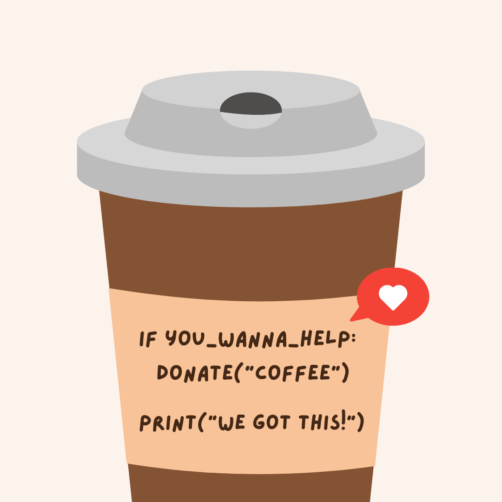

# Buy Me a Coffee - Community Crowdfunding ☕️

## Update 2022 🥳
Obrigada a todos os que participaram neste crowdfunding! 🎁 Estamos a trabalhar para oficializar a associação até ao final de Fevereiro, e iremos regressar em breve com novos workshops (Data Science e Tecnologias Web 2) e mais oportunidades para eventos presenciais.

Neste momento, o Crowdfunding encontra-se **terminado**. Se tu ou a tua empresa gostava de se tornar um patrocinador oficial do projeto, por favor contacta-nos para [asraparigasdocodigo@gmail.com](asraparigasdocodigo@gmail.com).

## Descrição da Campanha
🌲 Durante Dezembro estamos a lançar uma campanha de community crowdfunding que nos ajudará no processo de oficialização do projeto d'As Raparigas do Código, nomeadamente com a criação de uma Associação Sem Fins Lucrativos ♥️

👉 Constituir a associação vai permitir-nos ter um NIF, que é essencial para que possamos receber patrocínios e apoios de empresas, e estabelecer parcerias com outras entidades!

💻 **O nosso objectivo é e sempre será continuar a manter os workshops e eventos completamente gratuitos**, conseguindo os serviços e apoios que precisamos a partir de empresas e entidades parceiras. Mas sem criar a associação, não conseguimos avançar. 

## Objectivos
Um novo ano está à porta, e nós precisamos de renovar alguns serviços, por exemplo, o domínio do website, cujos custos têm sido suportados por nós até à data, "sem problema" 😉

Neste momento, os custos associados à criação da empresa e da contabilidade organizada são um pouco acima das nossas possibilidades 😅

E é por isso que estamos a pedir a vossa ajuda! 💛

Se tudo correr como esperado, será a primeira e única ajuda vossa que iremos precisar para conseguir que o projeto comece a ter parceiros oficiais! 🚀

No total, estimamos precisar de **cerca de 1000€**.

- Domínio [raparigasdocodigo.pt](https://raparigasdocodigo.pt): 26€/ano;

- Servidor: conseguimos apoio em créditos (temos servidor por 2 anos, malta! 🎁);

- Criação de Associação: 300€ ([eportugal.gov.pt](https://eportugal.gov.pt/servicos/criar-uma-associacao-na-hora)
, [justica.gov.pt](https://justica.gov.pt/Servicos/Registar-associacao));

- Contabilidade Organizada: Empresa de Contabilidade (nos primeiros 5 meses): 500€ (valor de 100€/mês orçamentado);

- Honorários de Advogada/o: (❓) Estamos a procurar dentro dos nossos contactos alguma ajuda para escrever os estatutos sem custo; 

## 💰 Se quiserem, como podem contribuir?
<!-- Por MB WAY, para qualquer um dos seguintes membros da direcção: -->

<!---  913-589-565 (Miriam Santos) -->
<!-- - 912-228-922 (Pedro Fonseca) -->
<!-- - 918-409-387 (Joana Lopes) -->

<!--‼️ ⚠️ Por favor, coloquem na descrição "Doação ARDC", para ser facilmente identificado! -->

<!--No final do mês, como agradecimento, estamos a pensar criar um workshop de Natal/Ano Novo, que **será aberto a toda a comunidade, independentemente de quem puder contribuir para o crowdfunding!** -->

Neste momento, o Crowdfunding encontra-se **terminado**. Se tu ou a tua empresa gostava de se tornar um patrocinador oficial do projeto, por favor contacta-nos para [asraparigasdocodigo@gmail.com](asraparigasdocodigo@gmail.com).

## 🎮 Progresso das Doações:
Vão poder ver o [progresso das doações aqui!](https://miriamspsantos.github.io/buy-me-a-coffee/)
